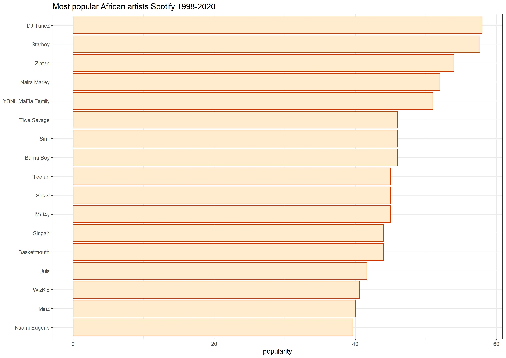

# Afrobeats
Analysis of popular African music on Spotify
# Project description: 
I read an article about [popular podcasts in Kenya](https://nation.africa/kenya/newsplex/kenya-s-best-and-highest-earning-podcasts-3288260) and how this medium is catching on. It got me curious about which datasets on media or the arts :performing_arts: specifically from Africa was out there. On kaggle I found a dataset of African music on Spotify, most is from Nigerian artists, this is why I use the term afrobeats to describe it. Here are some plots from this data in R 

## 1. What is the most common genre in Afrobeats music?
The original data set has a field called "Popularity", starting from zero to the highest 73. I chose to filter out all zero values. 
No surprises here, afrobeats draws alot from dancehall music i.e. in terms of the beats. So no wonder one of the most popular genres represented is dancehall. 
Unfortunately some songs had no genre attributed to them, that is why there is a category called "Missing", this is not a real African music genre :smile:


## 2. Most danceable Afrobeats songs on Spotify 
Danceability is one of the attributes of Spotify data. Danceability "describes how suitable a track is for dancing. Values range from 0.0 being least danceable and 1.0 being most danceable." 


## 3.Most danceable songs by African artists on Spotify
I chose to explore particular artists discography. I chose Wizkid and Davido, there was no formula to this, they just happen to have been in the industry for a long time. 
Here are the plots for each one, thought it would be more representative to have a background image of the artist for each plot. When you choose to use a background image for your plots, consider picking something that is not too busy. For this Wizkid photo, I chose one where the artist has plain grey in the background. This makes it easier for you when adjusting your bar colors for instance.

        #Filter songs by Wizkid
        WizKid_df<-filter(nigeriansongs,artist=="WizKid")
        WizKid_df <- WizKid_df[-c(1),] 

        #Load the background images to use in plot
        wizkid_img <- readJPEG("wizkid.jpg")

      #To insert background image use the annotation custom function of the ggplot2 package 
      #and the rasterGrob-function of the grid package
      ggplot(WizKid_df,aes(x=reorder(name,danceability),danceability))+ 
      ggtitle("Wizkid most danceable songs on Spotify")+xlab("")+
      scale_fill_continuous(guide = FALSE)+
      annotation_custom(rasterGrob(wizkid_img, 
                               width = unit(1,"npc"), 
                               height = unit(1,"npc")), 
                    -Inf, Inf, -Inf, Inf)+
      geom_bar(stat = "identity",position = "dodge",alpha=0.5,fill="orangered",colour="grey")+ 
      coord_flip()+ scale_x_discrete(labels=wrap_format(15))


I did the same for Davido. However, I could not find a photo in a good size with a grey background. To get good color matches, you need to play around with R colors to find something that works 


## 4. Which African artists are most popular on Spotify?
For this, I filtered them out of the data set based on average of the popularity scores of their songs.

```
#Artists with highest average popularity scores
artist_summary <- nigeriansongs %>%
  group_by(artist) %>%
  summarise(popularity = mean(popularity, na.rm = TRUE))

#Highest popularity score is 73, filter out those with 40 and above
topartist<-filter(artist_summary,popularity > 39)

#Top African artists on Spotify
ggplot(data = topartist, mapping = aes(x = reorder(artist, popularity), popularity))+ 
  geom_bar(stat = "Identity",fill="blanchedalmond",color="orangered3") + 
  ggtitle("Most popular African artists Spotify 1998-2020")+
  coord_flip()+ theme_bw()+ scale_x_discrete(labels(wrap_format(10))+theme_light())

```
Once you look at the plot, you notice that both Starboy and Wizkid appear, same person right? Not so much, an article on Medium explains that each moniker is associated with a particular style of music targeted at different audiences. Wizkid content is targeted at his international audience, while Starboy caters to his Nigerian fan base who love his afrobeat vibe. Read more about this here: [Wizkid or StarBoy, what's the difference?](https://medium.com/@txt_mag/wizkid-or-starboy-whats-the-difference-48000d7a846b). In this dataset, some of the artists featured include Comedians, such as the "Basketmouth" channel, had to look them up since I had not heard of them before. I chose to leave the plot as is but one can certainly filter out this group. 




