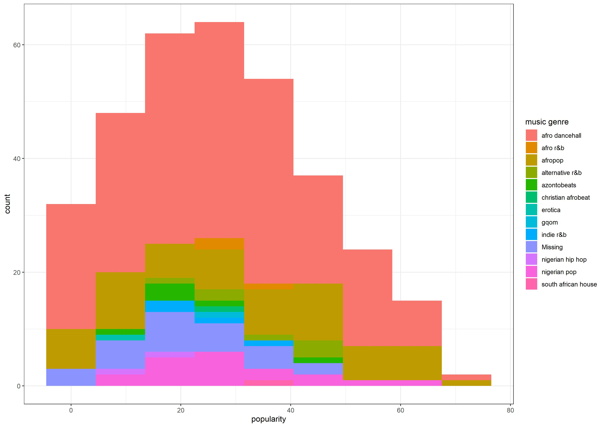
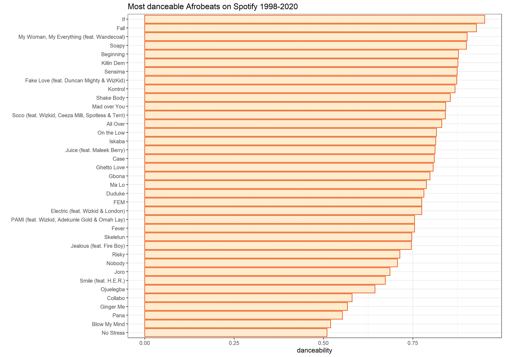
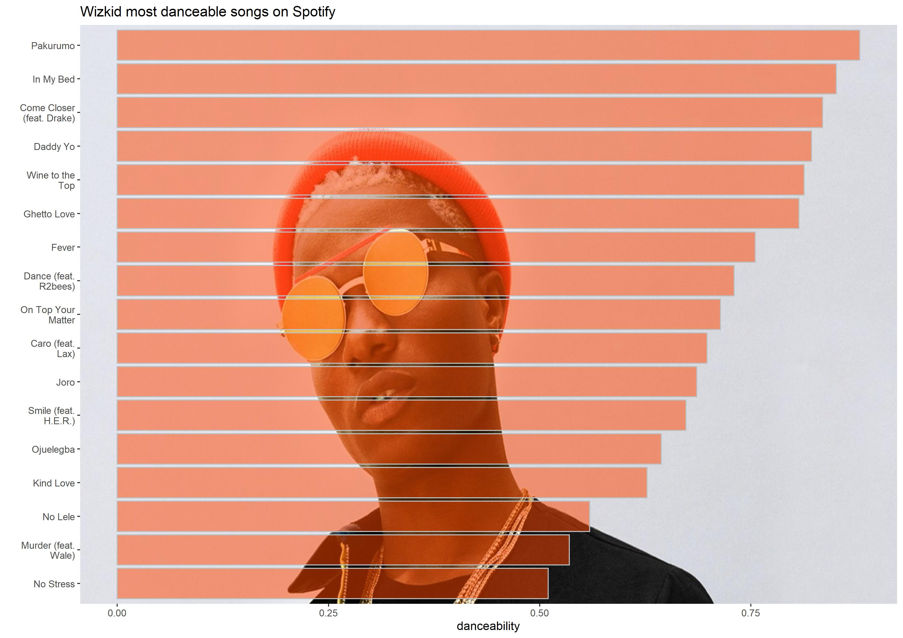
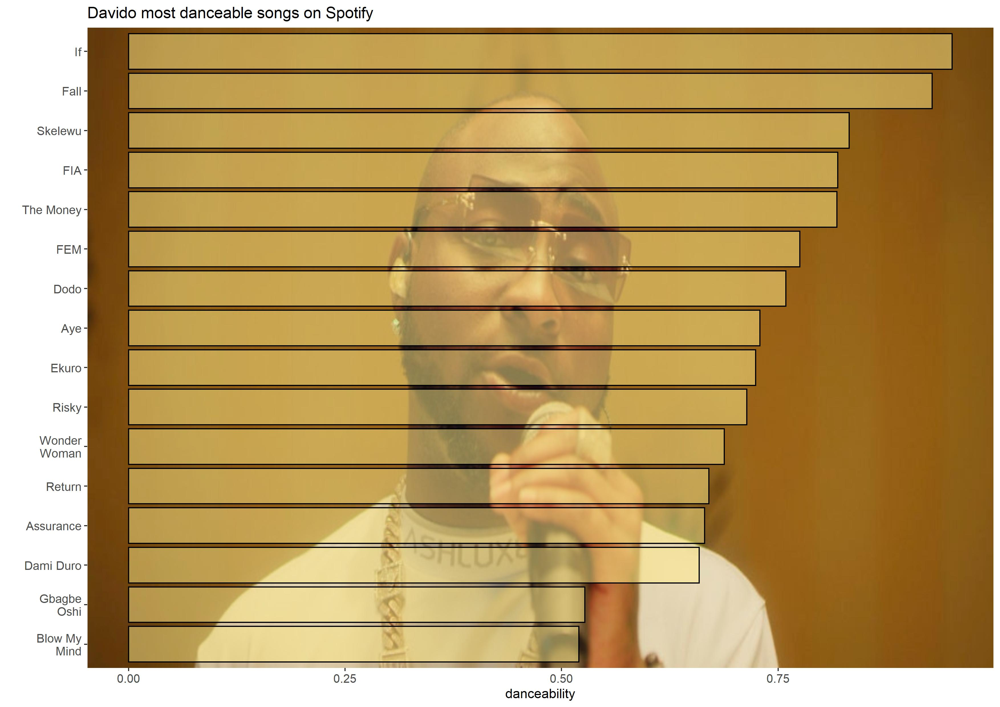

# Afrobeats
Analysis of popular African music on Spotify
# Project description: 
This post is inspired by an article about popular podcasts in Kenya (https://nation.africa/kenya/newsplex/kenya-s-best-and-highest-earning-podcasts-3288260).I looked on Kaggle and found a dataset of African music on Spotify, most is from Nigerian artists so will refer to this data as the Afrobeats data set. Here are some plots from this data in R, access the code above. 

## 1. What is the most common genre in Afrobeats music?
The original data set has a field called "Popularity", starting from zero to the highest 73. I chose to filter out all zero values. 
No surprises here, afrobeats draws alot from dancehall music i.e. in terms of the beats. So no wonder one of the most popular genres represented is dancehall. 

## 2. Which are the most danceable songs? 
Danceability is one of the attributes of Spotify data. Danceability "describes how suitable a track is for dancing. Values range from 0.0 being least danceable and 1.0 being most danceable." 

## 3.Most danceable songs by artist 
I chose to explore particular artists discography. I chose Wizkid and Davido, there was no formula to this, they just happen to have been in the industry for a long time. 
Here are the plots for each one, thought it would be more representative to have a background image of the artist for each plot. When you choose to use a background image for your plots, consider picking something that is not too busy. For this Wizkid photo, I chose one where the artist has plain grey in the background. This makes it easier for you when adjusting your bar colors for instance.

I did the same for Davido. However, I could not find a photo in a good size with a grey background. To get good color matches, you need to play around with R colors to find something that works 

